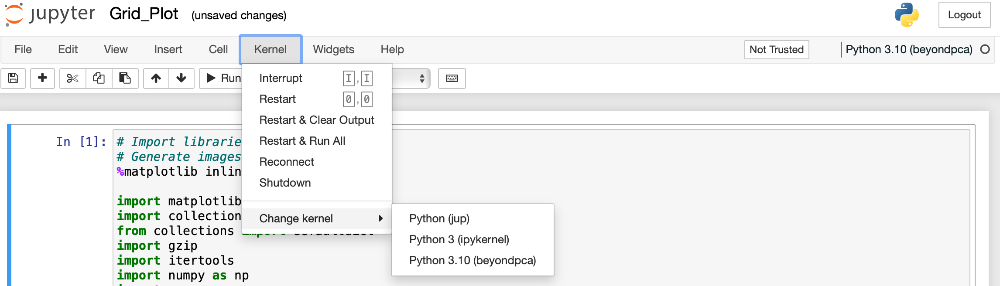

- [Getting Started](#Getting-Started)
  * [Installing Jupyter Notebook](#Installing-Jupyter-Notebook)
      + [Using Conda](#Using-Conda)
- [Tutorial](#Tutorial)
  * [Generating Input Files](#Generating-Input-Files)
    + [Estimation of Genotype Likelihoods](#Estimation-of-Genotype-Likelihoods)
    + [Principal Component Analysis using Genotype Likelihoods](#Principal-Component-Analysis-using-Genotype-Likelihoods)
    + [Important Points to Consider](#Important-Points-to-Consider)
  * [Running t-SNE and UMAP with the Principal Components of Genotype Likelihoods](#Running-t-SNE-and-UMAP-with-the-Principal-Components-of-Genotype-Likelihoods)
     + [Loading Required Libraries](#Loading-Required-Libraries)
     + [Creating Color Palette for Different Populations](#Creating-Color-Palette-for-Different-Populations)
     + [Loading the Population Data and Covariance Matrix](#Loading-the-Population-Data-and-Covariance-Matrix)
     + [Performing Elbow Method for the Selection of Principal Components](#Performing-Elbow-Method-for-the-Selection-of-Principal-Components)
     + [Performing t-SNE and UMAP with a Grid Search](#Performing-t-SNE-and-UMAP-with-a-Grid-Search)
     + [Visualizing the Results](#Visualizing-the-Results)
  * [t-SNE and UMAP without PCA Initialization](#t-SNE-and-UMAP-without-PCA-Initialization)
 - [Citation](#Citation)

    
Getting Started
===========================================
This repository is about ..

Installing Jupyter Notebook
------------------------

### Using Conda

For new users, we highly recommend [installing Conda](https://conda.io/projects/conda/en/latest/user-guide/install/index.html) and creating a conda environment which includes the required packages to run the Jupyter Notebook and the subsequent analysis detailed in the following tutorial.

Use the following installation steps:

1. Download [Anaconda](https://www.anaconda.com/download). We recommend
   downloading Anaconda's latest Python 3 version (currently Python 3.11).

2. Install the version of Anaconda which you downloaded, following the
   instructions on the download page.

3. Congratulations, you have installed Jupyter Notebook. To run the notebook:

   
    ```bash
    jupyter notebook

See [Running the Notebook](https://docs.jupyter.org/en/latest/running.html#running) for more details.

Tutorial
===========================================

Generating Input Files
------------------------
### Estimation of Genotype Likelihoods
In this tutorial, we will use SO_2x dataset and explain related analysis steps for a single input file. 


Bu tutorial'da oryx datasi uzerinden gidicez, onun angsd kodunu acikliycaz.

### Principal Component Analysis using Genotype Likelihoods

### Important Points to Consider
Angsd ile ilgili. Missingness, minor allela freq onemi, citation ile guideline cok guzel buna bakabilirsiniz diycez.

Running t-SNE and UMAP with the Principal Components of Genotype Likelihoods
------------------------
### Loading Required Libraries
In the following sections we will go over a single input covariance matrix obtained with (SO_2x). For the corresponding Jupyter Notebook refer to XX1.ipynb

For running subsequent analyses with multiple covariance matrices you can refer to XXX2.ipynb

The first step is to load required libraries. For this, we need to activate the conda environment (env_name):
```bash
conda activate env_name
```

Next, we need to initiate the jupyter notebook:
```bash
jupyter notebook XX1.ipynb
```

Then, a browser windor will be opened. From there we will select the conda environment we created as a kernel:



In this jupyter notebook the first code block is for loading required libraries:

```python
# Import libraries
import numpy as np
import pandas as pd
import seaborn as sns
import matplotlib.pyplot as plt
from kneed import KneeLocator

# Dimension reduction tools
from sklearn.decomposition import PCA as PCA
from sklearn.manifold import TSNE
import umap
```

### Creating Color Palette for Different Populations

A custom color palette is created for Oryx populations as in (REF):
```python
#for Oryx datasets:
custom_palette = {
    "EAD_A": "#cada45", #green
    "EAD_B": "#d4a2e1", #purple
    "EEP": "#55e0c6", #blue
    "USA": "#f0b13c", #orange
}
```

### Loading the Population Data and Covariance Matrix

Covariance matrix and population data for Oryx samples are loaded:

```python
#load population data
population_names = pd.read_csv('population_info/oryx_pop_info_sorted_46_final.txt', sep='\t', header=0)
#load the covariance matrix
filename='cov_files/oryx_2xyh_1K.cov'
cov_mat= pd.read_csv(filename, sep=' ', header=None)
#Generating the pandas dataframe called Data_Struct
Data_Struct=population_names
```

### Performing Elbow Method for the Selection of Principal Components

First the functions to calculate the 'elbow point' (using *kneed*, [Satopaa et al., 2011](https://github.com/arvkevi/kneed/tree/v0.8.5)) and scree plot functions are defined:

```python
# Function to plot the scree plot
def plot_scree(explained_variance,filename_title,elbow_point):
    plt.figure(figsize=(8, 4))
    # Convert to a simple list if it's not already
    explained_variance = list(explained_variance)
    plt.plot(range(1, len(explained_variance) + 1), explained_variance, marker='o', linestyle='--')
    plt.axvline(x=elbow_point, color='r', linestyle='--')
    plt.text(elbow_point + 0.1, max(explained_variance) * 0.9, f'Elbow: {elbow_point}', color='red', verticalalignment='center')
    plt.title(f'Scree Plot | {filename_title}')
    plt.xlabel('Number of Components')
    plt.ylabel('Variance Explained')
    plt.grid()
    plt.show()

# Function to find the elbow point
def find_elbow_point(explained_variance, sensitivity=1.0):
    explained_variance = list(explained_variance)
    kneedle = KneeLocator(range(1, len(explained_variance) + 1), explained_variance, 
                          curve='convex', direction='decreasing', 
                          S=sensitivity, interp_method='polynomial')
    return kneedle.elbow
```
Next, principal component analysis is performed:

```python
#Calculate PCA
#convert covariance matrix to numpy array
cov_mat_np=cov_mat.to_numpy()

# calculate eigen vectors and eigen values from the initial covariance matrix
eigen_vals, eigen_vecs = np.linalg.eig(cov_mat_np)
eigen_pairs = [(np.abs(eigen_vals[i]), eigen_vecs[:, i]) for i in range(len(eigen_vals))]
eigen_pairs.sort(key=lambda k: k[0], reverse=True)
feature_vector = np.hstack([eigen_pairs[i][1][:, np.newaxis] for i in range(len(eigen_vals))])
principal_components = cov_mat_np.dot(feature_vector) 

# sorting them from largest to smallest
idx = eigen_vals.argsort()[::-1]   
eigenValues = eigen_vals[idx]
eigenVectors = eigen_vecs[:,idx]

# calculating the total explained variance
expl_pre=eigenValues/sum(eigenValues)
expl=np.cumsum(expl_pre)

expl_df=pd.DataFrame(expl_pre*100,columns=['explained_variance'])
expl_df['cumulative_expl']=expl*100
expl_df.set_index(np.arange(1, eigenVectors.shape[0] + 1), inplace=True)
```
Finally, elbow point is calculated and plotted together with the scree plot:


### Performing t-SNE and UMAP with a Grid Search


### Visualizing the Results

t-SNE and UMAP without PCA Initialization
------------------------


Citation
===========================================

